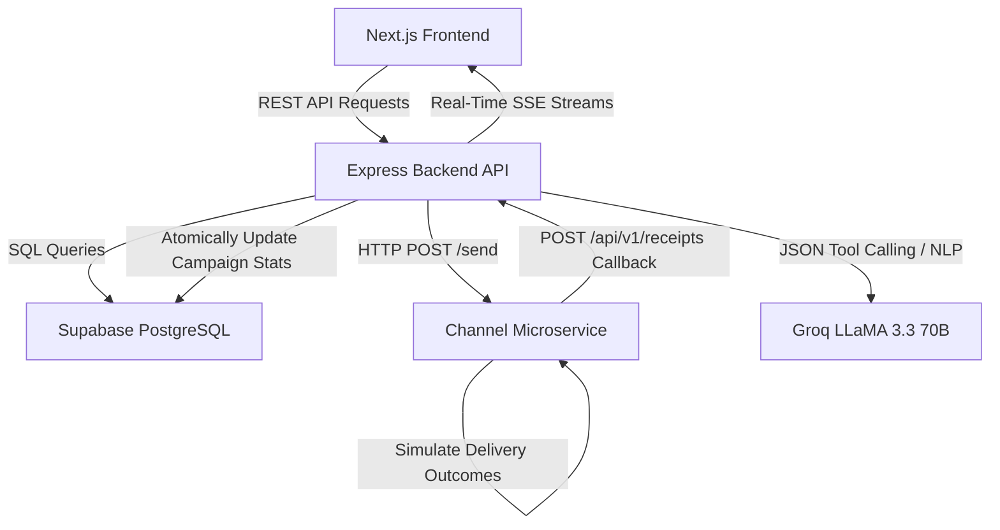

# Vertex CRM - AI-Native Customer Relationship Management

Vertex is a production-grade, enterprise-ready Customer Relationship Management (CRM) platform designed for BrewCo, a premium coffee chain. Built using a modern TypeScript stack, it enables intelligent customer segmentation, personalized marketing campaign execution, and real-time delivery performance tracking with Groq AI integration.

## Architecture Overview

The system is designed as a decoupled, multi-service architecture comprising:
1. **Next.js Frontend**: An enterprise-style dashboard interface featuring a visual segment builder, live campaign statistics panels, and an interactive AI Assistant interface.
2. **Express Backend API**: A Clean Architecture-based REST API (Route -> Controller -> Service -> Repository) that manages state, builds dynamic queries for segments, and handles delivery callbacks.
3. **Channel Service**: A separate microservice simulating message brokers (e.g., WhatsApp, SMS, RCS, Email) with probabilistic delivery outcomes and an exponential backoff callback retry queue.
4. **Supabase PostgreSQL**: Relational database storage for customers, orders, segments, campaigns, and communications.



## Features

### Dashboard Analytics
- Real-time key performance indicators (KPIs) showing total customer counts, active campaign counts, average delivery rates, and attributed revenue.
- Detailed performance charts showing delivered, opened, and clicked percentages over a rolling 14-day window.
- Actionable AI Insights showing proactive segment suggestions generated by analyzing general database patterns.

### Customer 360 & Segmentation
- Paginated data tables with debounced full-text search and filtering by city and gender.
- Detailed slide-in sheets presenting order history, segment membership, and historical campaign touchpoints.
- Visual segment builder supporting compound nested logical rules (AND/OR gates) mapping total spend, order count, days since last order, and visit count.
- Natural language to SQL rule parsing powered by Groq LLaMA 3.3.

### Automated Campaigns
- A four-step campaign wizard guiding marketers through segment selection, channel selection, template compilation, and final verification.
- Personalized message templates supporting key interpolation variables (name, city, total spend, order count, last order date).
- Live campaign stat trackers driven by Server-Sent Events (SSE) that show live progression from queued -> sent -> delivered -> opened -> read -> clicked.
- Post-campaign summary narrations generated by AI, identifying three specific optimization recommendations based on performance metrics.

### AI Assistant Agent
- Full-screen conversational workspace utilizing tool-calling capabilities.
- Access to seven distinct database and campaign operations (querying, creating, launching, checking stats).
- Visual action cards indicating which queries were run and formatting the tabular outputs for clean rendering.

### User Interface & Aesthetics
- **Sleek Theme Toggle**: Interactive Light and Dark mode toggling integrated into the Topbar across all application views.
- **Visual Previews & Analytics**: Demographics graphs (pie charts, bar charts, spend distribution) in segments detail views. Live Phone Preview visualizing compiled messaging templates for WhatsApp/SMS/Email/RCS.
- **Page-wide Refresh Buttons**: Dedicated refresh buttons on all core pages (Dashboard, Customers, Segments List, Segments Detail, Segment Builder, Campaigns List, Campaign Details, Campaign Wizard) with spinning state pending animation to fetch live updates.

## Quick Start

### Step 1: Database Setup (Supabase)
1. Register or log in at supabase.com.
2. Create a new database project named `vertex-crm`.
3. In the Supabase SQL Editor, paste and execute the schema definition from `backend/src/db/schema.sql`.

### Step 2: Groq API Key Setup
1. Register or log in at console.groq.com.
2. Navigate to API Keys and create a new key.

### Step 3: Configure Backend Environment
Create a `.env` file inside the `backend` folder with the following configuration:
```env
PORT=3001
NODE_ENV=development
DATABASE_URL=postgresql://postgres:[PASSWORD]@[HOST]:5432/postgres
SUPABASE_URL=https://[PROJECT-ID].supabase.co
SUPABASE_ANON_KEY=your_supabase_anon_key
GROQ_API_KEY=your_groq_api_key
FALLBACK_GROQ_API_KEY=your_fallback_groq_api_key  # Optional fallback key
CHANNEL_SERVICE_URL=http://localhost:3002
FRONTEND_URL=http://localhost:3000
```

### Step 4: Seed Database
Populate the database with realistic sample records:
```bash
cd backend
npm run seed
```
This inserts:
- 100 realistic Indian customer profiles across multiple cities.
- 500 historical order records utilizing mock BrewCo menu items.
- 8 pre-configured marketing segments.
- 5 mock campaign execution logs with complete statistics.

### Step 5: Start Services
Run each service in a separate terminal window:

```bash
# Terminal 1: Channel Simulator
cd channel-service
npm run dev

# Terminal 2: Backend REST API
cd backend
npm run dev

# Terminal 3: Next.js Frontend
cd frontend
npm run dev
```
Access the application at `http://localhost:3000`.

## API Documentation

### Analytics
- `GET /api/v1/analytics/dashboard` - Fetches aggregated dashboard metrics, charts, and campaign history.

### Customers
- `GET /api/v1/customers` - Paginated and queryable list of customers.
- `POST /api/v1/customers` - Creates a single customer profile.
- `POST /api/v1/customers/import` - Bulk imports multiple customer profiles.

### Segments
- `GET /api/v1/segments` - Lists all segments.
- `POST /api/v1/segments` - Creates a segment with logic rules.
- `POST /api/v1/segments/preview` - Dry-runs segment rules to preview matching size.

### Campaigns
- `GET /api/v1/campaigns` - Lists campaigns.
- `POST /api/v1/campaigns` - Creates a new draft campaign.
- `POST /api/v1/campaigns/:id/launch` - Executes and queues a campaign.
- `GET /api/v1/campaigns/:id/stream` - SSE stream delivering live campaign performance metrics.

### AI Endpoints
- `POST /api/v1/ai/chat` - AI Agent endpoint supporting tool calling (`query_customers`, `create_segment`, `preview_segment`, `create_campaign`, `launch_campaign`, `get_campaign_stats`, `list_campaigns`, `get_analytics_summary`).
- `POST /api/v1/ai/parse-segment` - Translates plain English instructions to segment rules.
- `POST /api/v1/ai/draft-message` - Generates channel-tailored templates.
- `POST /api/v1/ai/analyze-campaign` - Returns plain English performance takeaways.

## Engineering Standards

- **Clean Architecture Routing**: Clear separation between HTTP routing (routes), payload validation (Zod middleware), controller execution, business orchestration (services), and data mutation (repositories).
- **TypeScript Strict Compliance**: Standardized interfaces, compile-time checks, and avoidance of escape hatches (no `any` type annotations in the backend).
- **Graceful Shutdown**: Database connections are closed cleanly on SIGINT or SIGTERM signals.
- **Probabilistic Simulator**: The channel microservice simulates carrier delays and delivery funnels using a mathematical model matching real-world performance benchmarks.
